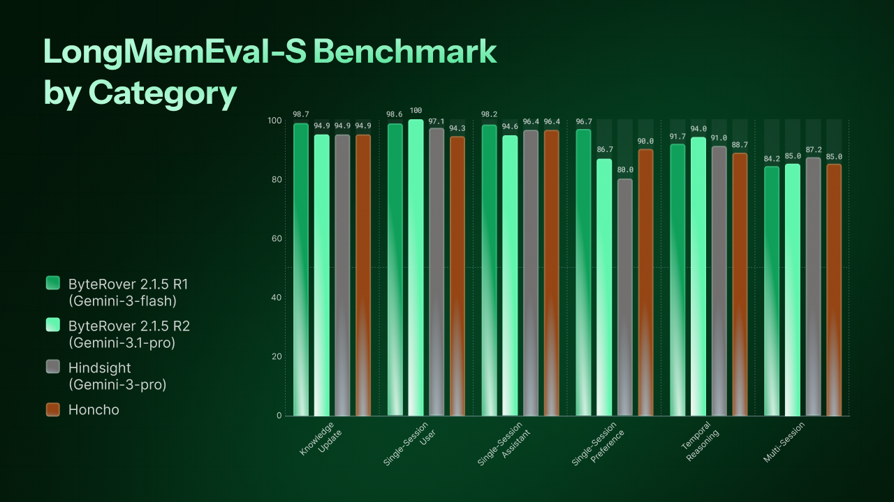

# ByteRover CLI

<div align="center">


<p align="center">
<em>Interactive REPL CLI for AI-powered context memory</em>
</p>

<p align="center">
<a href="LICENSE"></a>
<a href="https://npmjs.org/package/byterover-cli"></a>
<a href="https://npmjs.org/package/byterover-cli"></a>
<a href="https://docs.byterover.dev"></a>
<a href="https://discord.com/invite/UMRrpNjh5W"></a>
</p>

</div>

## Overview

ByteRover CLI (`brv`) gives AI coding agents persistent, structured memory. It lets developers curate project knowledge into a context tree, sync it to the cloud, and share it across tools and teammates.

Run `brv` in any project directory to start an interactive REPL powered by your choice of LLM. The agent understands your codebase through an agentic map, can read and write files, execute code, and store knowledge for future sessions.

📄 Read the [paper](https://byterover.dev/paper) for the full technical details.

**Key Features:**

- 🖥️ Interactive TUI with REPL interface (React/Ink)
- 🧠 Context tree and knowledge storage management
- 🤖 20+ LLM providers (Anthropic, OpenAI, Google, Groq, Mistral, xAI, and more)
- 🛠️ 24 built-in agent tools (code exec, file ops, knowledge search, memory management)
- 🔄 Cloud sync with push/pull
- 🔌 MCP (Model Context Protocol) integration
- 📦 Hub and connectors ecosystem for skills and bundles
- 🤝 Works with 22+ AI coding agents (Cursor, Claude Code, Windsurf, Cline, and more)
- 🏢 Enterprise proxy support

## Benchmark Results

All benchmarks are run using the production `byterover-cli` codebase in this repository - no separate research prototype.

We evaluate on two long-term conversational memory benchmarks:

- **LoCoMo** - ultra-long conversations (~20K tokens, 35 sessions) testing single-hop, multi-hop, temporal, and open-domain retrieval.
- **LongMemEval-S** - large-scale benchmark (23,867 docs, ~48 sessions per question) testing 6 memory abilities including knowledge update, temporal reasoning, and multi-session synthesis.

**LoCoMo** - 96.1% overall accuracy (1,982 questions, 272 docs).

**LongMemEval-S** - 92.8% overall accuracy (500 questions, 23,867 docs).

<p align="center">

</p>

All metrics are LLM-as-Judge accuracy (%). See the [paper](https://byterover.dev/paper) for full details.

## Quick Start

### Shell Script (macOS & Linux)

No Node.js required - everything is bundled.

```bash
curl -fsSL https://byterover.dev/install.sh | sh
```

Supported platforms: macOS ARM64, Linux x64, Linux ARM64.

### npm (All Platforms)

Requires Node.js >= 20.

```bash
npm install -g byterover-cli
```

### Verify

```bash
brv --version
```

### First Run

```bash
cd your/project
brv
```

The REPL auto-configures on first run - no setup needed. Type `/` to discover all available commands:

```
/curate "Auth uses JWT with 24h expiry" @src/middleware/auth.ts
/query How is authentication implemented?
```

<details>
<summary><h2>CLI Usage</h2></summary>

### Core Workflow

```bash
brv                  # Start interactive REPL
brv status           # Show project and daemon status
brv curate           # Add context to knowledge storage
brv curate view      # View curate history
brv query            # Query context tree and knowledge
```

### Sync

```bash
brv push             # Sync local context to cloud
brv pull             # Sync from cloud to local
```

### Providers & Models

```bash
brv providers list       # List available LLM providers
brv providers connect    # Connect to an LLM provider
brv providers switch     # Switch active provider
brv providers disconnect # Disconnect a provider
brv model list           # List available models
brv model switch         # Switch active model
```

### Hub & Connectors

```bash
brv hub list             # List available hub packages
brv hub install          # Install a hub package
brv hub registry add     # Add a custom registry
brv hub registry list    # List registries
brv hub registry remove  # Remove a registry
brv connectors list      # List connectors
brv connectors install   # Install a connector
```

### Spaces

```bash
brv space list       # List spaces
brv space switch     # Switch active space
```

### Other

```bash
brv mcp              # Start MCP server
brv login            # Authenticate to ByteRover
brv logout           # Disconnect and clear credentials
brv locations        # List registered projects
brv restart          # Restart daemon
brv debug            # Debug mode
```

Run `brv --help` for the full command reference.

</details>

<details>
<summary><h2>Supported LLM Providers</h2></summary>

ByteRover CLI supports 18 LLM providers out of the box. Use `brv providers connect` to set up a provider and `brv providers switch` to change the active one.

| Provider | Description |
|----------|-------------|
| Anthropic | Claude models |
| OpenAI | GPT models |
| Google | Gemini models |
| Groq | Fast inference |
| Mistral | Mistral models |
| xAI | Grok models |
| Cerebras | Fast inference |
| Cohere | Command models |
| DeepInfra | Open-source model hosting |
| OpenRouter | Multi-provider gateway |
| Perplexity | Search-augmented models |
| TogetherAI | Open-source model hosting |
| Vercel | AI SDK provider |
| Minimax | Minimax models |
| Moonshot | Kimi models |
| GLM | GLM models |
| OpenAI-Compatible | Any OpenAI-compatible API |
| ByteRover | ByteRover's hosted models |

</details>

## Documentation

Visit [**docs.byterover.dev**](https://docs.byterover.dev) for full guides on setup, integrations, and advanced usage.

| Topic | Description |
|-------|-------------|
| [Getting Started](https://docs.byterover.dev) | Installation, first run, and basic usage |
| [Cloud Sync](https://docs.byterover.dev) | Push/pull workflows and team sharing |
| [LLM Providers](https://docs.byterover.dev) | Provider setup and model configuration |
| [AI Agent Integrations](https://docs.byterover.dev) | Using ByteRover with Cursor, Claude Code, Windsurf, etc. |
| [Hub & Connectors](https://docs.byterover.dev) | Skills, bundles, and the connector ecosystem |
| CLI Reference | Run `brv --help` |

## Contributing

We welcome contributions! See our [Contributing Guide](CONTRIBUTING.md) for development setup, coding standards, and the PR workflow.

## Community & Support

ByteRover CLI is built and maintained by the [ByteRover team](https://byterover.dev/).

- Join our [Discord](https://discord.com/invite/UMRrpNjh5W) to share projects, ask questions, or just say hi
- [Report issues](https://github.com/campfirein/byterover-cli/issues) <!-- TODO: ENG-1575 --> on GitHub
- If you enjoy ByteRover CLI, please give us a star on GitHub — it helps a lot!
- Follow [@kevinnguyendn](https://x.com/kevinnguyendn) on X

## Contributors

<!-- TODO: ENG-1575 -->
[](https://github.com/campfirein/byterover-cli/graphs/contributors)

## License

Elastic License 2.0. See [LICENSE](LICENSE) for full terms.
